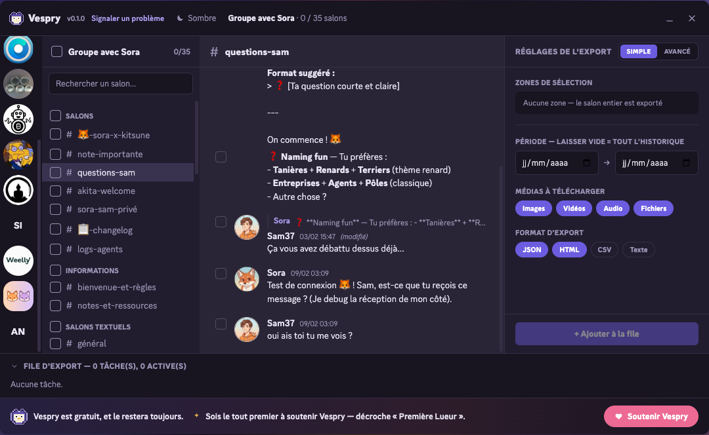

<div align="center">


# Vespry

### L'export increvable de ton historique Discord

*Un serveur que tu quittes, des messages à garder, une communauté qui ferme.*
*Discord ne te laisse rien emporter. Vespry, si.*

<br/>

[](LICENSE)
[](https://github.com/ateliersam86/vespry/actions/workflows/ci.yml)
[](package.json)
[](https://developer.chrome.com/docs/extensions/develop/migrate)
[](tsconfig.json)
[](src/engine)
[](https://crowdin.com/project/vespry)

<br/>

**Chrome · Edge · Brave · Opera · Arc · Firefox**

[Installation](#-installation) ·
[Fonctionnalités](#-fonctionnalités) ·
[Vespry vs les autres](#-vespry-face-aux-autres-outils) ·
[Confidentialité](#-confidentialité) ·
[Contribuer](#-traductions)

</div>

<br/>

<div align="center">

<!-- GALERIE — captures réelles. Tant que les fichiers ne sont pas
     présents dans docs/screenshots/, GitHub affiche le texte alt. -->



<em>Le panneau Vespry s'ouvre par-dessus Discord, dans une interface que tu connais déjà.</em>

</div>

<br/>

---

## 🦉 Pourquoi Vespry

La plupart des extensions d'export **cassent sur les gros serveurs**. Elles
chargent tout l'historique d'un bloc, le navigateur dépasse le délai, l'onglet
plante, et tu n'as rien.

Vespry prend le problème à l'envers :

- **Chaque centaine de messages est écrite sur le disque** (IndexedDB) au fur
  et à mesure.
- Si l'export s'interrompt (onglet fermé, plantage, coupure), **il reprend
  depuis le dernier point enregistré** au lieu de tout recommencer.
- L'export tourne **dans un contexte séparé** de l'onglet Discord : tu peux
  fermer l'onglet, il continue.

Le résultat est une **archive `.zip` locale**, lisible par un humain comme par
un agent IA, que personne d'autre que toi ne voit passer.

<br/>

---

## ✨ Fonctionnalités

<table>
<tr>
<td width="50%" valign="top">

### 🛡️ Increvable
Reprise après interruption, écriture par lots sur disque, export hors de
l'onglet Discord. Le cœur du projet, couvert par les tests.

</td>
<td width="50%" valign="top">

### 🔒 100 % local
Aucun serveur Vespry ne voit tes messages. Chiffrement AES-256 optionnel du
zip, mot de passe jamais persisté.

</td>
</tr>
<tr>
<td width="50%" valign="top">

### 🤖 Agent-ready
Sortie JSON structurée avec schéma (`$schema`, `typeName`, `localPath`) :
prête à être donnée à un agent IA ou à ton second cerveau.

</td>
<td width="50%" valign="top">

### 🗓️ Planifiable
Backup incrémental récurrent d'un serveur, quotidien ou hebdomadaire, via
`chrome.alarms`. Vespry se réveille seul et te notifie.

</td>
</tr>
<tr>
<td width="50%" valign="top">

### 🎨 Quatre formats
JSON, HTML (façon Discord), CSV, TXT, plusieurs à la fois en une passe.
Avatars, emojis, vidéos et audio rendus en local.

</td>
<td width="50%" valign="top">

### 🌍 15 langues
Interface traduite et ouverte aux contributions via Crowdin, sans toucher
au code.

</td>
</tr>
</table>

<br/>

<details>
<summary><strong>Voir le détail de chaque fonctionnalité</strong></summary>

<br/>

**Interface façon Discord** — À gauche, tes serveurs et conversations privées ;
au centre, l'aperçu des messages (markdown rendu, réponses citées, réactions,
stickers, embeds, médias inline) ; à droite, les réglages. Thème sombre ou
clair. Deux modes : **Simple** par défaut, **Avancé** sur un clic.

**Multi-sélection de salons + plage de dates** — Coche autant de salons que tu
veux et fixe une fenêtre temporelle ; la file traite chaque salon dans l'ordre.

**Sélection de messages un par un** — Coche les messages voulus dans l'aperçu ;
ils s'ajoutent au panneau de droite. Combinable avec les filtres.

**Filtres booléens, zones granulaires** — Période, auteur, mot-clé, mention,
épinglés, avec image / vidéo / son / sticker / embed / lien. Les zones se
combinent en **ET** ou **OU**, et chacune peut être **inversée** (NON).

**Export incrémental** — Un nouvel export ne récupère que les messages postés
depuis la dernière fois. La date du dernier export est affichée.

**Chiffrement AES-256** — Mot de passe en RAM uniquement, jamais persisté ni
envoyé. Jauge de force. Avertissement clair : zip irrécupérable si oublié.

**Templates de nom de fichier** — `{guildName}-{date}.zip`,
`{datetime}-{guildName}.zip`, avec aperçu en direct.

**Découpage des gros salons** — 5 000 / 10 000 / 25 000 messages par fichier,
plutôt qu'un seul fichier ingérable.

**Suppression bulk** — Triple garde-fou : sélection requise, modal de
confirmation, saisie du mot « SUPPRIMER ». Sérielle (≈ 5/s), idempotente.

**File d'export increvable** — Avancement par tâche, console temps réel, badge
de pourcentage sur l'icône. Reprise d'un export interrompu.

**Tutoriel interactif** — Au premier lancement, un tour guidé montre où cliquer.
Rejouable depuis le popup.

**Réinitialisation** — Un bouton purge toutes les données Vespry locales
(historique, préférences, planning) en cas de besoin.

</details>

<br/>

---

## 📸 Galerie

> **Captures réelles en cours d'intégration.** Elles sont prises sur un serveur
> de démonstration dédié pour ne rien exposer d'un vrai serveur privé.

<table>
<tr>
<td align="center" width="33%">
<br/>
<sub><b>Sélection</b> — serveurs, salons, messages</sub>
</td>
<td align="center" width="33%">
<br/>
<sub><b>Réglages</b> — formats, filtres, chiffrement</sub>
</td>
<td align="center" width="33%">
<br/>
<sub><b>File d'export</b> — progression temps réel</sub>
</td>
</tr>
<tr>
<td align="center" width="33%">
<br/>
<sub><b>Export HTML</b> — rendu façon Discord</sub>
</td>
<td align="center" width="33%">
<br/>
<sub><b>Planification</b> — backup récurrent</sub>
</td>
<td align="center" width="33%">
<br/>
<sub><b>Popup</b> — état de session, historique</sub>
</td>
</tr>
</table>

<br/>

---

## 📊 Vespry face aux autres outils

| | Vespry | DiscordChatExporter | Discrub | Extensions freemium |
|---|:--:|:--:|:--:|:--:|
| Type | extension | appli desktop | extension | extension |
| **Reprise après interruption** | ✅ | ❌ | ❌ | ❌ |
| **Export incrémental natif** | ✅ | partiel | ❌ | ⚠️ payant |
| **Plusieurs formats en un export** | ✅ | ❌ | ❌ | ❌ |
| Formats JSON / HTML / CSV / TXT | ✅ | ✅ | JSON/HTML/CSV | variable |
| Découpage des gros salons | ✅ | ✅ | ✅ | ❌ |
| Filtres booléens (ET / OU / NON) | ✅ | ✅ texte | partiel | ❌ |
| Filtres `has:` (image, vidéo, sticker…) | ✅ | ✅ | ✅ | ❌ |
| Serveurs, forums, threads, DMs, groupes | ✅ | ✅ | ✅ | partiel |
| Réactions, embeds, stickers, réponses | ✅ | ✅ | ✅ | partiel |
| Téléchargement des médias | ✅ | ✅ | ✅ | ✅ |
| Aperçu avant export | ✅ | ❌ | ✅ | partiel |
| **Planification (daily / weekly)** | ✅ | ❌ | ❌ | ❌ |
| **Chiffrement zip AES-256** | ✅ | ❌ | ❌ | ❌ |
| **Templates de nom de fichier** | ✅ | ❌ | ❌ | ❌ |
| Suppression bulk de messages | ✅ | ❌ | ✅ | ❌ |
| **Langues de l'interface** | **15** | limité | anglais | anglais |
| Gratuit, sans quota | ✅ | ✅ | ✅ | ❌ |
| Open source | ✅ MIT | ✅ MIT | ✅ MIT | ❌ |
| **Tout local, aucun compte externe** | ✅ | ✅ | ✅ | ❌ |
| Télémétrie | opt-in, OFF | aucune | ⚠️ | ❌ analytics |

<div align="center"><sub>Vespry est le seul à reprendre un export interrompu sans installer d'application, à planifier des backups récurrents, à chiffrer le zip en AES-256, et le seul traduit en 15 langues.</sub></div>

<br/>

---

## 🚀 Installation

> En attendant la publication sur les stores.

<table>
<tr>
<td valign="top" width="50%">

**Chrome · Brave · Opera · Arc · Edge**

1. Récupère le dossier `dist/` (ou compile-le).
2. `chrome://extensions` → **mode développeur**.
3. **Charger l'extension non empaquetée** → `dist/`.
4. Ouvre Discord, connecte-toi. Le bouton **Vespry** apparaît en haut à droite.

</td>
<td valign="top" width="50%">

**Firefox**

1. `npm run build:firefox` → `dist-firefox/`.
2. `about:debugging#/runtime/this-firefox`.
3. **Charger un module temporaire** → `dist-firefox/manifest.json`.
4. Ouvre Discord, connecte-toi.

</td>
</tr>
</table>

<br/>

---

## 📦 Le fichier exporté

L'export est une archive `.zip` autonome :

- les messages, dans les formats choisis, **un fichier par salon** ;
- les **médias téléchargés**, rangés dans des dossiers ;
- un `INDEX.md` qui récapitule le contenu ;
- *(optionnel)* chiffrement **AES-256** si tu as fourni un mot de passe.

<br/>

---

## 🔐 Confidentialité

**Vespry tourne entièrement en local.** Tes conversations, les médias, les
exports : tout vit dans la mémoire de ton navigateur puis dans le `.zip` que tu
télécharges. Rien ne transite par un serveur Vespry.

**Les seuls flux sortants, tous explicites :**

| Flux | Quand | Ce qui sort |
|---|---|---|
| **Discord API** | toujours | ton jeton de session (comme ton client Discord) |
| **Stripe** | don uniquement | rien tant que tu ne donnes pas |
| **Worker dons** | affichage du mur | lecture seule, agrégats publics |
| **GitHub** | check de version | IP / User-Agent (requête anonyme) |
| **Signalement schéma** | **opt-in, OFF** | uniquement les *noms* de nouveaux champs Discord |

Aucune analytics, aucun pixel, aucun tracker. Détail complet dans
[`PRIVACY.md`](PRIVACY.md).

<br/>

---

## 🌍 Traductions

[](https://crowdin.com/project/vespry)

Vespry est traduit en **15 langues** :

🇬🇧 English · 🇫🇷 Français · 🇩🇪 Deutsch · 🇪🇸 Español · 🇮🇹 Italiano ·
🇵🇹 Português · 🇳🇱 Nederlands · 🇵🇱 Polski · 🇫🇮 Suomi · 🇹🇷 Türkçe ·
🇷🇺 Русский · 🇯🇵 日本語 · 🇰🇷 한국어 · 🇨🇳 中文 · 🇮🇳 हिन्दी

Contributions ouvertes sur [Crowdin](https://crowdin.com/project/vespry) :
édition dans le navigateur, mémoire de traduction, sans toucher au code. Les
chaînes validées arrivent automatiquement en PR.

<br/>

---

## 🛠️ Développement

```bash
npm install
npm run dev              # build watch + HMR Chrome
npm run build            # build Chrome production -> dist/
npm run build:firefox    # build Firefox production -> dist-firefox/
npm run test             # tests unitaires (vitest) — 173 tests
npm run typecheck        # vérification de types
npm run firefox:lint     # web-ext lint pour AMO
```

TypeScript strict, Manifest V3, Vite, Preact. Le moteur d'export est couvert
par **173 tests unitaires** : reprise d'un export interrompu, streaming
AES-256, suppression idempotente.

<br/>

---

## 💜 Soutenir le projet

Gratuit et open source, sans publicité. Si l'outil t'a rendu service :

- [**GitHub Sponsors**](https://github.com/sponsors/ateliersam86) — récurrent.
- Bouton **Soutenir** dans l'extension — don ponctuel via Stripe.

Les soutiens publics apparaissent sur le **mur des soutiens** de l'extension.

<br/>

---

## 💬 Contact

- 💡 **Proposer une idée** : [Discussions GitHub](https://github.com/ateliersam86/vespry/discussions/new?category=ideas)
- 🐛 **Signaler un bug** : [Issues GitHub](https://github.com/ateliersam86/vespry/issues)
- ✉️ **Privé** : profil [@ateliersam86](https://github.com/ateliersam86)

<br/>

---

## ⚠️ Avertissement

Automatiser un compte utilisateur Discord est contraire aux conditions
d'utilisation de Discord. Cet outil est fourni tel quel ; utilise-le sur tes
propres données, à tes risques. Au premier export, Vespry affiche un
avertissement que tu dois valider.

Vespry n'est pas affilié à Discord Inc. « Discord » et son logo sont des
marques de Discord Inc.

<br/>

---

## 📄 Licence

[](LICENSE)

Le client API Discord (`src/engine/discord-api.ts`) dérive de Discrub Classic
(MIT). « Discrub » est une marque de prathercc, non utilisée ici.

<div align="center">

<br/>

**© 2026 Samuel Muselet — [L'Atelier de Sam](https://atelier-sam.fr)**

*fait avec passion 🦉*

</div>
