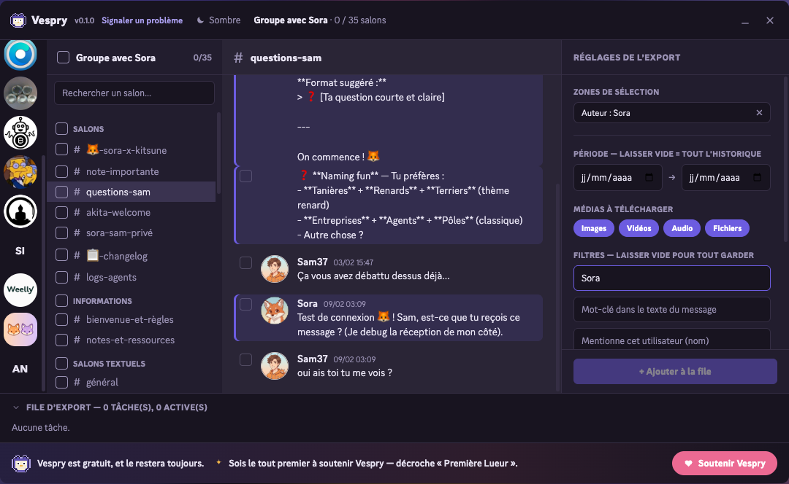
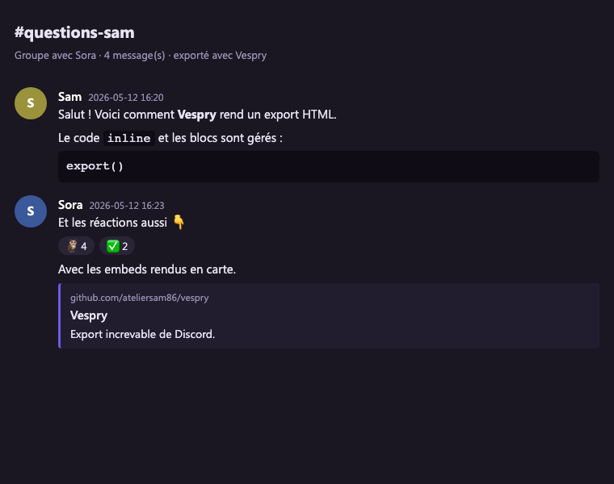

# Vespry

Vespry est une extension Chrome qui exporte l'historique de tes conversations
Discord — serveurs, salons, messages privés — dans un fichier, sur ton
ordinateur.

Un serveur que tu quittes, des messages privés à garder, une communauté qui
ferme : Discord ne te laisse rien emporter. Vespry, si.


## Le problème

La plupart des extensions d'export cassent sur les gros serveurs. Elles
chargent tout l'historique d'un bloc, le navigateur dépasse le délai, l'onglet
plante — et tu n'as rien.

Vespry prend le problème à l'envers. Chaque centaine de messages est écrite sur
le disque (IndexedDB) au fur et à mesure. Si l'export s'interrompt — onglet
fermé, plante, coupure — il reprend depuis le dernier point enregistré au lieu
de tout recommencer. L'export tourne dans un contexte séparé de l'onglet
Discord : tu peux fermer l'onglet, il continue.

## Vespry face aux autres outils

| | Vespry | DiscordChatExporter | Discrub | Extensions freemium |
|---|:--:|:--:|:--:|:--:|
| Type | extension | appli desktop | extension | extension |
| **Reprise après interruption** | ✅ | ❌ | ❌ | ❌ |
| **Export incrémental** | ✅ | ❌ | ❌ | ❌ |
| Formats : JSON / HTML / CSV / TXT | ✅ | ✅ | JSON/HTML/CSV | variable |
| Plusieurs formats en un export | ✅ | ❌ | ❌ | ❌ |
| Découpage des gros salons | ✅ | ✅ | ❌ | ❌ |
| Filtres booléens (ET / OU / NON) | ✅ | ✅ | partiel | ❌ |
| Filtres `has:` (image, vidéo, sticker…) | ✅ | ✅ | ✅ | ❌ |
| Serveurs, forums, threads, DMs, groupes | ✅ | ✅ | ✅ | partiel |
| Capture : réactions, embeds, stickers, réponses | ✅ | ✅ | ✅ | partiel |
| Téléchargement des médias | ✅ | ✅ | ✅ | ✅ |
| Aperçu avant export | ✅ | ❌ | ✅ | partiel |
| **Langues de l'interface** | 15 | anglais | anglais | anglais |
| Gratuit, sans quota | ✅ | ✅ | ✅ | ❌ quotas |
| Open source | ✅ | ✅ | ✅ | ❌ |

Vespry est le seul à reprendre un export interrompu et à faire de l'incrémental
sans installer d'application, et le seul traduit en 15 langues. Il ne supprime
pas de messages : c'est un outil d'export, pas de modération — volontairement.

## Fonctionnalités

### Interface façon Discord

L'extension s'ouvre par-dessus Discord. À gauche, tes serveurs et tes
conversations privées ; au centre, l'aperçu des messages ; à droite, les
réglages de l'export. Rien à apprendre — c'est la disposition que tu connais
déjà. Thème sombre ou clair, au choix.

Le panneau de réglages a deux modes : **Simple** (l'essentiel — période,
médias, format) et **Avancé** (filtres, découpage, options). Pas de fouillis
par défaut.

### Zones de sélection

Tu n'es pas obligé de tout exporter. Une zone de sélection cible une partie
précise de l'historique : une période, un auteur, un mot-clé, une mention, les
messages épinglés, ceux avec une image, une vidéo, un son, un sticker, un
embed ou un lien. Tu peux aussi cocher des messages un par un dans l'aperçu.

Les zones se combinent en **ET** ou en **OU**, et chacune peut être **inversée**
(NON). Sans aucune zone, le salon entier est exporté.



### Quatre formats d'export

Tu choisis dans quels formats générer l'export — un seul, ou plusieurs à la
fois :

- **JSON** — structuré et fidèle, idéal pour archiver ou analyser.
- **HTML** — une page lisible façon Discord : messages groupés, réactions,
  stickers, embeds, réponses citées, médias en local.
- **CSV** — pour tableur (Excel, LibreOffice).
- **TXT** — texte brut, le plus léger.



### Export incrémental

Une fois un serveur exporté, un nouvel export en mode incrémental ne récupère
que les messages postés depuis la dernière fois — pas besoin de tout
re-télécharger.

### Découpage des gros salons

Un salon de centaines de milliers de messages peut être découpé en fichiers
de taille bornée, plutôt qu'un seul fichier ingérable.

### Aperçu des messages

Avant d'exporter, tu vois le contenu réel du salon : messages, réactions,
images, audio, vidéo, stickers, embeds. L'aperçu défile à l'infini — remonte
aussi loin que tu veux dans l'historique.

### File d'export increvable

Les exports s'enchaînent dans une file. Chaque tâche affiche son avancement,
une console en temps réel, le détail par type de média. Pendant un export, un
badge de pourcentage s'affiche sur l'icône de l'extension — visible quel que
soit l'onglet où tu es. Un export interrompu peut être repris ; c'est le cœur
de Vespry, et c'est couvert par les tests automatiques.

### Popup

Un clic sur l'icône de l'extension : l'état de la session, les exports en
cours, l'accès rapide à Discord.


## Installation

En attendant la publication sur le Chrome Web Store :

1. Récupère le dossier `dist/` (ou compile-le, voir plus bas).
2. `chrome://extensions` → active le **mode développeur**.
3. **Charger l'extension non empaquetée** → sélectionne le dossier `dist/`.
4. Ouvre Discord, connecte-toi. Le bouton **Vespry** apparaît en haut à droite.

## Le fichier exporté

L'export est une archive `.zip` autonome :

- les messages, dans les formats choisis, un fichier par salon ;
- les médias téléchargés, rangés dans des dossiers ;
- un `INDEX.md` qui récapitule le contenu.

## Traductions

[](https://crowdin.com/project/vespry)

Vespry est traduit dans 15 langues. Les chaînes vivent dans
`src/locales/<lang>.json`. Le projet est ouvert aux contributions sur
[Crowdin](https://crowdin.com/project/vespry) — édition dans le
navigateur, mémoire de traduction, suggestions IA, sans toucher au
code. Quand des chaînes sont validées, Crowdin pousse automatiquement
une PR sur le dépôt.

L'anglais est la langue source ; les 14 autres sont traduites par la
communauté.

## Soutenir le projet

Vespry est gratuit et open source, sans publicité. Si l'outil t'a rendu
service, tu peux soutenir son développement via
[GitHub Sponsors](https://github.com/sponsors/ateliersam86).

## Développement

```bash
npm install
npm run dev        # build watch + HMR
npm run build      # build de production -> dist/
npm run test       # tests unitaires (vitest)
npm run typecheck  # vérification de types
```

L'extension est en TypeScript strict (Manifest V3, Vite, Preact). Le moteur
d'export est couvert par des tests unitaires, dont la reprise d'un export
interrompu.

## Avertissement

Automatiser un compte utilisateur Discord est contraire aux conditions
d'utilisation de Discord. Cet outil est fourni tel quel ; utilise-le sur tes
propres données, à tes risques.

## Licence

MIT. Le client API Discord (`src/engine/discord-api.ts`) dérive de Discrub
Classic (MIT). « Discrub » est une marque de prathercc, non utilisée ici.
