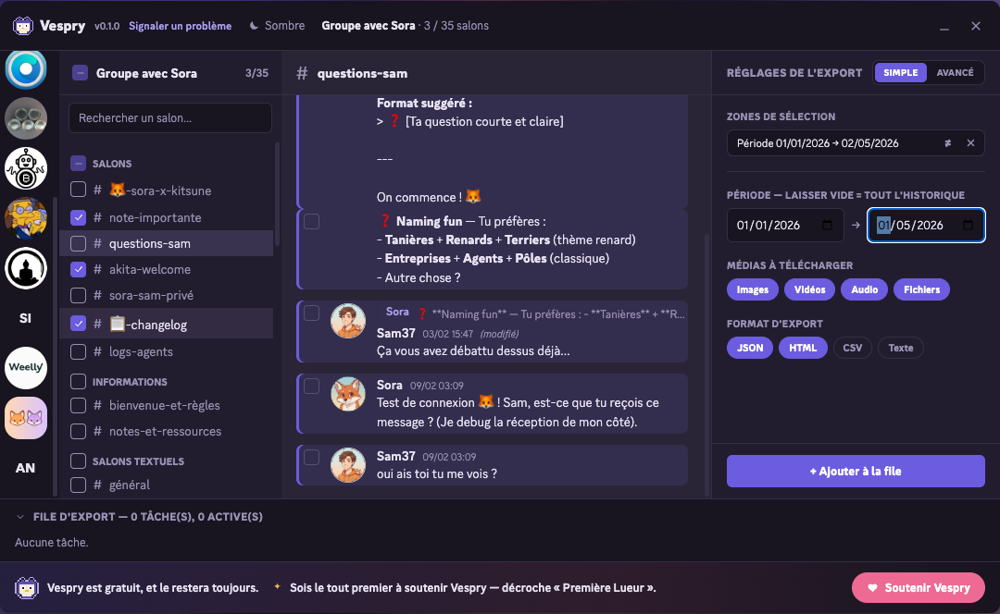
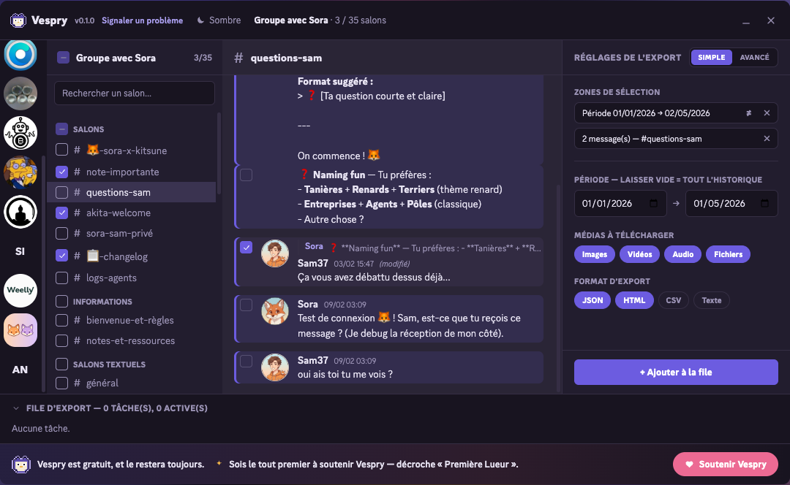
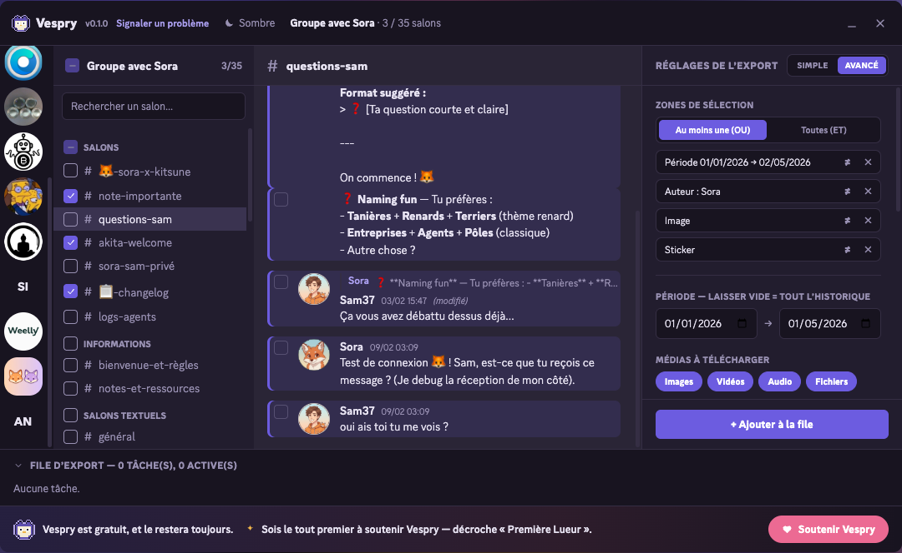
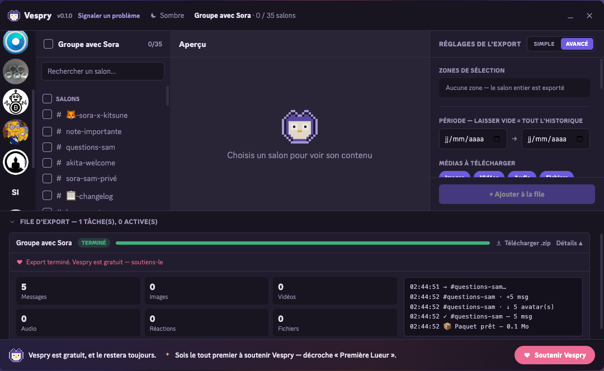

# Vespry

Vespry est une extension de navigateur qui exporte l'historique de tes
conversations Discord — serveurs, salons, messages privés — dans un fichier,
sur ton ordinateur. Chrome, Edge, Firefox.

Un serveur que tu quittes, des messages privés à garder, une communauté qui
ferme : Discord ne te laisse rien emporter. Vespry, si.


## Le problème

La plupart des extensions d'export cassent sur les gros serveurs. Elles
chargent tout l'historique d'un bloc, le navigateur dépasse le délai, l'onglet
plante — et tu n'as rien.

Vespry prend le problème à l'envers. Chaque centaine de messages est écrite sur
le disque (IndexedDB) au fur et à mesure. Si l'export s'interrompt — onglet
fermé, plante, coupure — il reprend depuis le dernier point enregistré au lieu
de tout recommencer. L'export tourne dans un contexte séparé de l'onglet
Discord : tu peux fermer l'onglet, il continue.

## Vespry face aux autres outils

| | Vespry | DiscordChatExporter | Discrub | Extensions freemium |
|---|:--:|:--:|:--:|:--:|
| Type | extension | appli desktop | extension | extension |
| **Reprise après interruption** | ✅ | ❌ | ❌ | ❌ |
| **Export incrémental natif** | ✅ | partiel (médias) | ❌ | ⚠️ payant |
| **Plusieurs formats en un export** | ✅ | ❌ | ❌ | ❌ |
| Formats JSON / HTML / CSV / TXT | ✅ | ✅ | JSON/HTML/CSV | variable |
| Découpage des gros salons | ✅ par messages | ✅ par messages ou taille | ✅ par messages | ❌ |
| Filtres booléens (ET / OU / NON) | ✅ | ✅ syntaxe texte | partiel | ❌ |
| Filtres `has:` (image, vidéo, sticker…) | ✅ | ✅ | ✅ | ❌ |
| Serveurs, forums, threads, DMs, groupes | ✅ | ✅ | ✅ | partiel |
| Capture : réactions, embeds, stickers, réponses | ✅ | ✅ | ✅ | partiel |
| Téléchargement des médias | ✅ | ✅ | ✅ | ✅ |
| Aperçu avant export | ✅ | ❌ | ✅ | partiel |
| **Planification (daily / weekly UTC)** | ✅ | ❌ | ❌ | ❌ |
| **Chiffrement zip AES-256** | ✅ | ❌ | ❌ | ❌ |
| **Templates de nom de fichier** | ✅ | ❌ | ❌ | ❌ |
| Suppression bulk de messages cochés | ✅ | ❌ | ✅ | ❌ |
| **Langues de l'interface** | 15 | ⚠️ récente, périmètre limité | anglais | anglais |
| Gratuit, sans quota | ✅ | ✅ | ✅ | ❌ quotas |
| Open source | ✅ MIT | ✅ MIT | ✅ MIT (legacy) | ❌ |
| **Tout en local, aucun compte externe** | ✅ | ✅ | ✅ | ❌ comptes externes |
| Télémétrie | opt-in défaut OFF | ❌ aucune | ⚠️ version current | ❌ analytics |

Vespry est le seul à reprendre un export interrompu sans installer
d'application, à planifier des exports récurrents, à chiffrer le zip en
AES-256, et le seul traduit en 15 langues.

## Fonctionnalités

### Interface façon Discord

L'extension s'ouvre par-dessus Discord. À gauche, tes serveurs et tes
conversations privées ; au centre, l'aperçu des messages — markdown rendu,
réponses citées, réactions, stickers, embeds, médias inline ; à droite, les
réglages de l'export. Rien à apprendre — c'est la disposition que tu connais
déjà. Thème sombre ou clair, au choix.

Le panneau de réglages a deux modes : **Simple** par défaut (période, médias,
format, l'essentiel) et **Avancé** sur un clic (filtres, découpage,
planification, chiffrement, templates de nom, suppression). Pas de fouillis
par défaut.

### Multi-sélection de salons et plage de dates

Coche autant de salons que tu veux dans la colonne de gauche et fixe une
fenêtre temporelle — la file traitera chaque salon, dans l'ordre, en
respectant la période.



### Sélection de messages un par un

Dans l'aperçu central, coche les messages que tu veux garder. Ils s'ajoutent
au panneau de droite sous forme d'étiquette « X messages — #salon » que tu
peux retirer d'un clic. Tu peux combiner cette sélection manuelle avec les
filtres : les deux s'ajoutent.



### Mode Avancé : filtres booléens, zones granulaires

En mode Avancé, une zone de sélection cible une partie précise de
l'historique : période, auteur, mot-clé, mention, messages épinglés, ceux
avec une image, une vidéo, un son, un sticker, un embed ou un lien.

Les zones se combinent en **ET** ou en **OU**, et chacune peut être **inversée**
(NON). Tu peux dire « auteur Sora ET avec image », ou « tout sauf épinglés ».



### Quatre formats d'export, plusieurs à la fois

Tu choisis dans quels formats générer l'export — un seul, ou plusieurs en une
passe :

- **JSON** — structuré et fidèle, idéal pour archiver ou analyser.
- **HTML** — une page lisible façon Discord : messages groupés, réactions,
  stickers, embeds, réponses citées, médias en local.
- **CSV** — pour tableur (Excel, LibreOffice).
- **TXT** — texte brut, le plus léger.


### Export incrémental

Une fois un serveur exporté, un nouvel export en mode incrémental ne récupère
que les messages postés depuis la dernière fois — pas besoin de tout
re-télécharger.

### Planification (daily / weekly)

En mode Avancé, tu programmes un export incrémental récurrent d'un serveur,
quotidien ou hebdomadaire, à une heure UTC fixe. Vespry se réveille tout seul
via `chrome.alarms`, lance l'export en arrière-plan et te notifie quand le
zip est prêt. Un planning actif à la fois — change-le quand tu veux.


### Chiffrement zip AES-256

Une option du mode Avancé. Tu saisis un mot de passe, Vespry chiffre l'archive
finale en **AES-256** (algorithme standard, lisible par 7-Zip, Keka, WinRAR).
Le mot de passe ne quitte jamais la RAM — il n'est pas persisté, pas écrit dans
le manifest, pas envoyé. Si tu l'oublies, le zip est irrécupérable : Vespry te
le dit clairement avant de chiffrer. Une jauge de force aide à choisir.


### Templates de nom de fichier

Plutôt que `vespry-MonServeur.zip`, tu peux choisir un patron :
`{guildName}-{date}.zip`, `{datetime}-{guildName}.zip`, ce que tu veux. Les
placeholders `{guildName}`, `{date}` (ISO `YYYY-MM-DD`) et `{datetime}`
(`YYYY-MM-DDTHHMM`) sont remplacés à la volée. Un aperçu en direct te montre
ce que sera le nom final. Persisté dans `chrome.storage.local`.


### Découpage des gros salons

Un salon de centaines de milliers de messages peut être découpé en fichiers
de taille bornée (5 000, 10 000 ou 25 000 messages par fichier), plutôt qu'un
seul fichier ingérable.

### Suppression bulk de messages cochés

Vespry sait aussi **supprimer** sur Discord des messages que tu as
soigneusement cochés dans l'aperçu. Triple garde-fou : le bouton n'apparaît
qu'avec au moins un message sélectionné ; un modal affiche le nombre exact et
le salon ; tu dois **taper le mot** « SUPPRIMER » avant que le bouton rouge
s'active. La suppression est sérielle (≈ 5/s pour rester dans les limites
Discord), idempotente sur les messages déjà disparus, et trace dans la console
chaque succès ou refus.

C'est utile pour effacer un thread privé, retirer ses messages d'un serveur
qu'on quitte, ou nettoyer un DM avant archivage. Vespry n'édite pas les
messages, ne purge pas un compte entier en un clic, ne supprime pas
indistinctement — par sécurité.


### File d'export increvable

Les exports s'enchaînent dans une file. Chaque tâche affiche son avancement,
une console en temps réel, le détail par type de média. Pendant un export, un
badge de pourcentage s'affiche sur l'icône de l'extension — visible quel que
soit l'onglet où tu es. Un export interrompu peut être repris ; c'est le cœur
de Vespry, et c'est couvert par les tests automatiques.



### Popup

Un clic sur l'icône de l'extension : l'état de la session, les exports en
cours, l'accès rapide à Discord.


## Confidentialité

**Vespry tourne entièrement en local sur ton ordinateur.** Tes conversations
Discord, les médias téléchargés, les exports — tout vit dans la mémoire de ton
navigateur (IndexedDB) puis dans le fichier `.zip` que tu télécharges. Rien ne
sort, rien ne transite par un serveur Vespry.

**Trois exceptions, toutes explicites :**

1. **Discord** — Vespry parle à l'API Discord avec **ton** jeton de session,
   exactement comme ton client Discord. C'est forcément le cas pour récupérer
   tes messages — c'est l'opération elle-même.
2. **Stripe** (dons uniquement) — quand tu choisis de soutenir le projet, la
   page de paiement est ouverte par Stripe dans une popup. Aucune carte ne
   touche le code de Vespry. Rien n'est envoyé à Stripe si tu ne donnes pas.
3. **Télémétrie de schéma** — opt-in **explicite**, désactivée par défaut.
   Si tu choisis de la cocher dans le panneau Avancé, Vespry envoie au service
   Vespry un message contenant **uniquement** :

   - la version de Vespry,
   - la langue de ton navigateur (`fr-FR`),
   - les **noms** des champs Discord rencontrés qui ne sont pas encore rendus
     (par exemple `voice_notes_v2`), filtrés à `[a-z][a-z0-9_]+`.

   **Jamais** : ton jeton, le contenu d'un message, un identifiant
   utilisateur, un identifiant de salon, un nom de personne, ton IP stockée,
   une stack trace. Le module `src/engine/schema-report.ts` fait moins de 80
   lignes, intégralement auditables.

   Ce signal sert à ouvrir automatiquement une issue GitHub publique quand
   Discord ajoute une fonctionnalité que Vespry ne sait pas encore rendre —
   pour que la mise à jour vienne vite et bénéficie à tout le monde.

Aucune analytics, aucun pixel, aucun tracker. Le code est public et lisible :
les ~70 lignes du module de télémétrie suffisent à vérifier ce qui sort.

## Installation

En attendant la publication sur les stores :

### Chrome / Brave / Opera / Arc

1. Récupère le dossier `dist/` (ou compile-le, voir plus bas).
2. `chrome://extensions` → active le **mode développeur**.
3. **Charger l'extension non empaquetée** → sélectionne le dossier `dist/`.
4. Ouvre Discord, connecte-toi. Le bouton **Vespry** apparaît en haut à droite.

### Microsoft Edge

Même procédure que Chrome — `edge://extensions`, mode développeur, charger
`dist/`. Vespry utilise le même build (Chromium).

### Firefox

1. Compile la cible Firefox : `npm run build:firefox` → `dist-firefox/`.
2. `about:debugging#/runtime/this-firefox` → **Charger un module
   complémentaire temporaire** → sélectionne `dist-firefox/manifest.json`.
3. Ouvre Discord, connecte-toi.

## Le fichier exporté

L'export est une archive `.zip` autonome :

- les messages, dans les formats choisis, un fichier par salon ;
- les médias téléchargés, rangés dans des dossiers ;
- un `INDEX.md` qui récapitule le contenu ;
- (optionnel) chiffrement AES-256 si tu as fourni un mot de passe.

## Traductions

[](https://crowdin.com/project/vespry)

Vespry est traduit dans **15 langues** :

🇬🇧 English · 🇫🇷 Français · 🇩🇪 Deutsch · 🇪🇸 Español · 🇮🇹 Italiano ·
🇵🇹 Português · 🇳🇱 Nederlands · 🇵🇱 Polski · 🇫🇮 Suomi · 🇹🇷 Türkçe ·
🇷🇺 Русский · 🇯🇵 日本語 · 🇰🇷 한국어 · 🇨🇳 中文 · 🇮🇳 हिन्दी

Les chaînes vivent dans `src/locales/<lang>.json`. Le projet est ouvert aux
contributions sur [Crowdin](https://crowdin.com/project/vespry) — édition
dans le navigateur, mémoire de traduction, suggestions IA, sans toucher au
code. Quand des chaînes sont validées, Crowdin pousse automatiquement une PR
sur le dépôt.

L'anglais est la langue source ; les 14 autres sont traduites par la
communauté.

## Soutenir le projet

Vespry est gratuit et open source, sans publicité. Si l'outil t'a rendu
service :

- [GitHub Sponsors](https://github.com/sponsors/ateliersam86) — récurrent.
- Bouton **Soutenir** dans l'extension — don ponctuel via Stripe Checkout.

Les soutiens publics apparaissent sur le **mur des soutiens** affiché dans le
pied de page de l'extension (servi par un Worker Cloudflare, contenu agrégé
seulement — pas d'identifiant Stripe en clair).

## Développement

```bash
npm install
npm run dev              # build watch + HMR Chrome
npm run build            # build Chrome production -> dist/
npm run build:firefox    # build Firefox production -> dist-firefox/
npm run test             # tests unitaires (vitest) — 142 tests
npm run typecheck        # vérification de types
npm run firefox:lint     # web-ext lint pour AMO
```

L'extension est en TypeScript strict (Manifest V3, Vite, Preact). Le moteur
d'export est couvert par 142 tests unitaires, dont la reprise d'un export
interrompu, le streaming AES-256, et la suppression idempotente.

## Avertissement

Automatiser un compte utilisateur Discord est contraire aux conditions
d'utilisation de Discord. Cet outil est fourni tel quel ; utilise-le sur tes
propres données, à tes risques.

## Licence

MIT. Le client API Discord (`src/engine/discord-api.ts`) dérive de Discrub
Classic (MIT). « Discrub » est une marque de prathercc, non utilisée ici.
